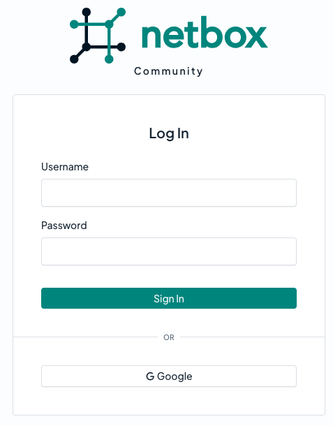
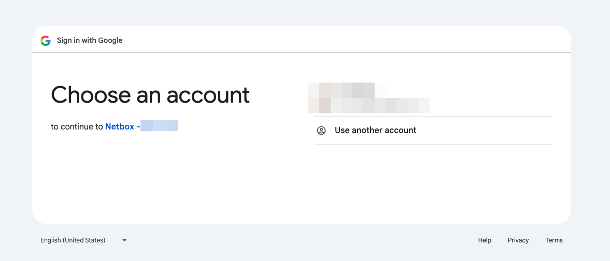

# Google

This guide explains how to configure single sign-on (SSO) support for NetBox using [Google OAuth2](https://developers.google.com/identity/protocols/oauth2/web-server) as an authentication backend.

## Google OAuth2 Configuration


1. Go to https://console.cloud.google.com/
1. Create new project for Netbox
1. Under ‘APIs and Services’ click ‘OAuth consent screen’ and complete the fields
1. Under ‘Credentials’ click ‘Create Credentials’ and select ‘OAuth 2.0 Client ID' web application’. Select type ‘Web application’
    - ‘Authorized JavaScript origins’ should look like: `http[s]://<netbox hostname>[:<port>]`
    - ‘Authorized redirect URIs’ should look like: `http[s]://<netbox hostname>[:<port>]/oauth/complete/google-oauth2/`
1. Copy the ‘Client ID’ and ‘Client Secret’ values somewhere convenient

NOTE: Google requires the Netbox hostname to use a public top-level-domain (e.g. `.com`, `.net`) . You cannot use an IP address (except `127.0.0.1`).

For more information, consult Google's documentation: https://developers.google.com/identity/protocols/oauth2/web-server#prerequisites
## NetBox Configuration

### 1. Enter configuration parameters

Enter the following configuration parameters in `configuration.py`, substituting your own values:

```python
REMOTE_AUTH_BACKEND = 'social_core.backends.google.GoogleOAuth2'
SOCIAL_AUTH_GOOGLE_OAUTH2_KEY = '{CLIENT_ID}'
SOCIAL_AUTH_GOOGLE_OAUTH2_SECRET = '{CLIENT_SECRET}'
```

### 2. Restart NetBox

Restart the NetBox services so that the new configuration takes effect. This is typically done with the command below:

```no-highlight
sudo systemctl restart netbox
```

## Testing

Log out of NetBox if already authenticated, and click the "Log In" button at top right. You should see the normal login form as well as an option to authenticate using Google. Click that link.



You should be redirected to Google's authentication portal. Enter the username/email and password of your test account to continue. You may also be prompted to grant this application access to your account.



If successful, you will be redirected back to the NetBox UI, and will be logged in as the Google user. You can verify this by navigating to your profile (using the button at top right).

This user account has been replicated locally to NetBox, and can now be assigned groups and permissions.